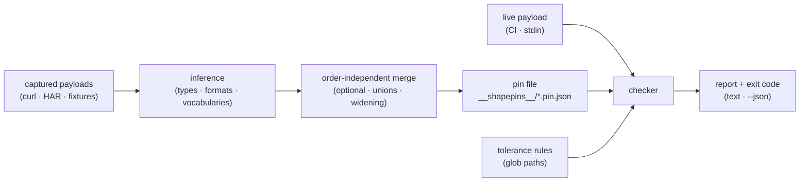

# shapepin

[English](README.md) | [中文](README.zh.md) | [日本語](README.ja.md)

[](LICENSE)   [](CONTRIBUTING.md)

**キャプチャした実サンプルから JSON ペイロードの構造を「ピン留め」し、レスポンスがドリフトしたら CI を失敗させる。コントラクトは手書きの仕様ではなく、手元にある実ペイロードから推論され、パス単位の許容ルールを備える。**


```bash
# not yet on npm — install from a checkout of this repository
npm install && npm run build && npm pack
npm install -g ./shapepin-0.1.0.tgz
```

## なぜ shapepin？

フロントエンドとバックエンドのコントラクトドリフトは、誰も予期しないバグの類型だ。バックエンドがフィールド名を変え、シリアライザが価格を文字列で出し始め、ORM のアップグレードが整数を浮動小数点に変える——バックエンドのテストは全部グリーンのまま、フロントエンドは本番で初めて気づく。教科書的な答えは CI で検証する OpenAPI 仕様だが、それは仕様が存在し、完全で、実際に同期され続けていることが前提であり、多くのチームは三つとも持っていない。一方でほぼすべてのチームが*実際に*持っているのは、キャプチャ済みのペイロードだ——curl の出力、HAR から抽出したボディ、フロントエンドのリポジトリに既にコミットされたフィクスチャ。shapepin はそれらのキャプチャそのものをコントラクトにする。実レスポンスを数件与えれば、ピン留めされた構造を推論する——必須／任意フィールド、整数か浮動小数点か、null 許容性、UUID や RFC 3339 タイムスタンプといった文字列フォーマット、さらに値が繰り返し現れる場合は閉じた列挙まで——決定的で git diff 可能な pin ファイルとして。以後 `shapepin check` はレスポンスが一致しなくなった瞬間に具体的なパス付きで CI を失敗させ、パス単位の許容ルールにより、受け入れると決めたドリフトだけ（`/orders/*/note=optional`）を通し、それ以外への扉は開かない。仕様を書く必要も、スキーマ言語を学ぶ必要もなく、ネットワーク不要、依存ゼロ。

| | shapepin | 手書き JSON Schema + ajv | OpenAPI + バリデータ | Pact | ペイロードの Jest スナップショット |
|---|---|---|---|---|---|
| コントラクトの源 | ✅ キャプチャした実ペイロード | ❌ 人手で執筆 | ❌ 人手で執筆 | ❌ 人手のコンシューマテスト | ✅ キャプチャ |
| コントラクト自体が正直であり続ける | ✅ 再ピン = 同一バイト | 🟡 現実から乖離する | 🟡 乖離で悪名高い | 🟡 規律頼み | ❌ どんな変化でも壊れる |
| *選んだ*ドリフトだけパス単位で許容 | ✅ 7 種のルール + glob パス | 🟡 スキーマを書き直し | 🟡 仕様を書き直し | 🟡 matcher コード | ❌ 全か無か |
| 新規／改名フィールドの検出 | ✅ デフォルト | 🟡 additionalProperties 次第 | 🟡 設定次第 | ✅ | ✅ ただし値ノイズに埋もれる |
| 値レベルのノイズ（id・タイムスタンプ） | ✅ 値でなくフォーマットをピン | ✅ | ✅ | ✅ | ❌ 実行のたびに差分 |
| broker / サーバ / ネットワークが必要 | ✅ 一切不要 | ✅ 不要 | ✅ 不要 | ❌ 実運用は broker 前提 | ✅ 不要 |
| ランタイム依存 | ✅ ゼロ | ❌ ajv スタック | ❌ バリデータスタック | ❌ かなり大きい | ❌ Jest スタック |

<sub>比較は各ツールの公開ドキュメントと挙動（2026-07 時点）に基づく。shapepin が検査するのは構造であり、値やビジネス的意味ではない——`total` が*正しく計算されたか*は意図的に問わず、いまも数値であるかだけを見る。正確なセマンティクスは [docs/pin-format.md](docs/pin-format.md) を参照。</sub>

## 特徴

- **コントラクトは推論するもの、執筆しないもの** — キャプチャ済みレスポンス数件に `shapepin pin` を向ければ、完全な構造コントラクトが得られる：必須／任意フィールド、整数か浮動小数点か、null 許容のユニオン、配列要素の構造。手元にあるキャプチャこそが仕様になる。
- **証拠に基づく列挙とフォーマット** — 文字列フィールドが `"delivered" | "pending" | "shipped"` にロックされるのは、値がキャプチャをまたいで繰り返された場合だけ（サンプル 1 件では決してロックしない）。UUID、RFC 3339 タイムスタンプ、日付、メール、URL は*フォーマット*としてピンされ、新しい id やタイムスタンプがノイズになることはない。
- **パス単位の許容ルール** — 7 種のルール（`optional`・`nullable`・`any`・`open-enum`・`open-format`・`number`・`extra-fields`）を glob パス（`/orders/*/note`、`/**/updatedAt`）で指定し、受け入れるドリフトだけを正確に通す。パターンの書き間違いはハードエラーであり、静かな空振りには決してならない。
- **バイト単位で決定的な pin ファイル** — 固定キー順・ソート済みフィールド・順序に依存しないマージ：同じキャプチャ群はどの順序で与えても同一バイトを生むため、pin の git diff が*そのまま*レビュアーの読むコントラクト変更になる。
- **CI ゲートのための設計** — 終了コード 0/1/2（クリーン／ドリフト／使用法エラー）、`curl | shapepin check` のための `-`（stdin）、機械向けの安定した `--json`、そして意図したドリフトを pin の拡張として同一コミットで受け入れる `check --update`。
- **ランタイム依存ゼロ、完全オフライン** — 推論・マッチング・検査・CLI はすべてリポジトリ内実装。必要なのは Node.js だけ、devDependency は `typescript` のみで、ソケットは一切開かない。

## クイックスタート

キャプチャ済みレスポンス数件からエンドポイントをピン留めする（架空の `GET /orders` の 3 ページ分、[examples/](examples/README.md) に同梱）：

```bash
cd examples/orders-api
shapepin pin orders captures/*.json --tolerate "/orders/*/note=optional"
shapepin show orders
```

```text
pinned "orders" from 3 examples → __shapepins__/orders.pin.json
pin "orders" — 3 examples, 1 tolerance
tolerances:
  /orders/*/note  optional
shape:
{
  orders: array of {
    currency: "USD"
    customer: {
      email: string (email)
      id: string (uuid)
    }
    id: string (uuid)
    items: array of {
      price: number
      qty: number (integer)
      sku: string
    }
    note: null | string
    placedAt: string (iso-date-time)
    status: "delivered" | "pending" | "shipped"
    total: number
    trackingNumber?: string
  }
  page: {
    number: number (integer)
    size: number (integer)
    totalPages: number (integer)
  }
}
```

この pin をコミットする。数週間後、バックエンドがシリアライザを「整理」する。CI が新しいキャプチャで `check` を実行し、終了コード 1 で失敗する（実際の実行出力）：

```text
$ shapepin check orders drifted/orders-drift.json
✗ drifted/orders-drift.json — 4 drift issues
  /orders/0/items/0/price     type-changed    pinned number, got string ("12.99")
  /orders/0/items/0/discount  new-field       field "discount" was never in a pinned example
  /orders/0/placedAt          format-changed  pinned iso-date-time string, got "tomorrow"
  /orders/0/status            new-enum-value  "canceled" is not one of "delivered" | "pending" | "shipped"
0 clean, 1 drifted, 4 issues · pin "orders" (3 examples, 1 tolerance)
```

新しい `"canceled"` ステータスは意図的だった？　ならそれだけを許容する——残り 3 件はビルドを失敗させ続ける：

```bash
shapepin tolerate orders "/orders/*/status=open-enum"
```

変更全体が意図的？　`shapepin check orders new.json --update` がペイロードを pin にマージし、拡張された pin ファイルはバックエンド変更と同じコミットに載る。

## コマンド

| コマンド | 動作 | 主なオプション |
|---|---|---|
| `pin <name> <files…>` | キャプチャ済みペイロードから pin を推論 | `--merge`・`--force`・`--split`・`--tolerate <p>=<r>` |
| `check <name> <files…>` | ペイロードを検証し、ドリフトで失敗 | `--update`・`--json` |
| `show <name>` | ピン留めされたシグネチャを表示 | `--json` |
| `ls` | pin とサンプル数を一覧 | `--json` |
| `tolerate <name> <p>=<r>` | 許容ルールの追加・削除 | `--rm` |

pin はフィクスチャの隣の `__shapepins__/` に置かれる（`--dir` で変更可）。`-` は stdin からペイロードを 1 件読む。終了コード：`0` クリーン、`1` ドリフト、`2` 使用法または入力エラー。

## 何がドリフトになるか

| ペイロード内の変化 | check の報告 | 静められる許容ルール |
|---|---|---|
| 必須フィールドの欠落 | `missing-field` | `optional` |
| 一度も見ていないフィールド | `new-field` | `extra-fields`（オブジェクト側に付与） |
| JSON 型の変化 | `type-changed` | — 設計上なし |
| 観測されたことのない場所の `null` | `null-value` | `nullable` |
| ロック済み列挙の外の値 | `new-enum-value` | `open-enum` |
| ピン済みフォーマットの崩れ（uuid・日付…） | `format-changed` | `open-format` |
| 整数しか見ていない場所の浮動小数点 | `number-widened` | `number` |

すべての問題は具体的なペイロードパス（`/orders/0/items/0/price`）を伴い、壊れたフィールドが別のフィールドを隠すことはない。完全なセマンティクス、列挙ロックのヒューリスティック、パターン言語は [docs/pin-format.md](docs/pin-format.md) にある。

## アーキテクチャ



## ロードマップ

- [x] 構造推論、順序非依存マージ、証拠ベースの列挙／フォーマット、7 種ドリフト検査器、パス単位許容、決定的 pin ファイル、pin/check/show/ls/tolerate CLI、89 テスト + スモークスクリプト（v0.1.0）
- [ ] `shapepin pin --from-har`：HAR ファイルからエンドポイント別にサンプルを抽出
- [ ] pin 同士の diff（`shapepin diff old.pin.json new.pin.json`）でコントラクトの進化をレビュー
- [ ] 配列と数値の長さ／範囲ファクト（オプトイン、デフォルト無効）
- [ ] pin から TypeScript 宣言を生成（`shapepin show --dts`）
- [ ] 稼働中のバックエンドに向けたローカル開発用 watch モード
- [ ] npm への公開

全リストは [open issues](https://github.com/JaydenCJ/shapepin/issues) を参照。

## コントリビュート

コントリビューション歓迎。`npm install && npm run build` でビルドし、`npm test` と `bash scripts/smoke.sh`（`SMOKE OK` の出力が必須）を実行する——このリポジトリは CI を同梱せず、上記のすべての主張はローカル実行で検証される。[CONTRIBUTING.md](CONTRIBUTING.md) を読み、[good first issue](https://github.com/JaydenCJ/shapepin/issues?q=is%3Aissue+is%3Aopen+label%3A%22good+first+issue%22) を選ぶか、[discussion](https://github.com/JaydenCJ/shapepin/discussions) を始めよう。

## ライセンス

[MIT](LICENSE)
