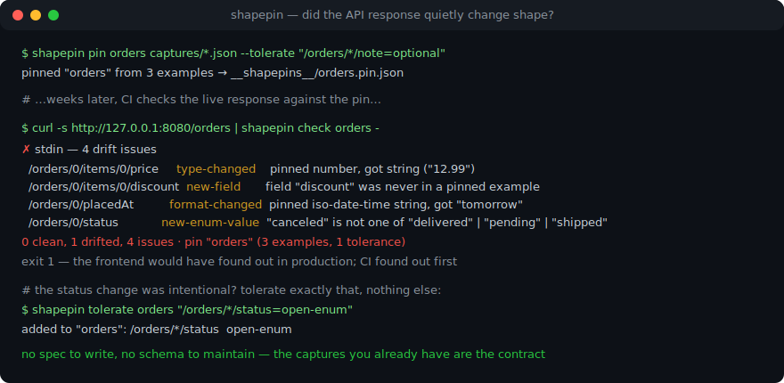
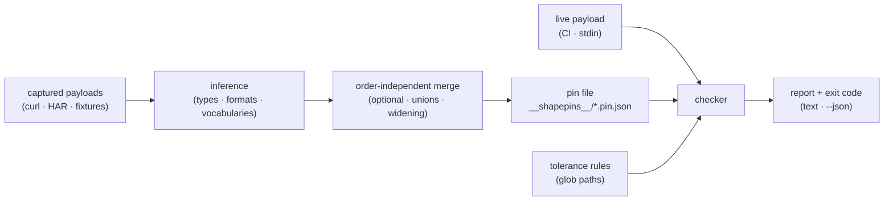

# shapepin

[English](README.md) | [中文](README.zh.md) | [日本語](README.ja.md)

[](LICENSE)   [](CONTRIBUTING.md)

**Pin the shape of JSON payloads from captured examples; fail CI when responses drift. Contracts are inferred from real payloads you already have — with per-path tolerance rules — not hand-written specs.**



```bash
# not yet on npm — install from a checkout of this repository
npm install && npm run build && npm pack
npm install -g ./shapepin-0.1.0.tgz
```

## Why shapepin?

Frontend–backend contract drift is the bug class nobody sees coming: the backend renames a field, a serializer starts emitting prices as strings, an ORM upgrade turns an integer into a float — every backend test stays green, and the frontend finds out in production. The textbook answer is an OpenAPI spec validated in CI, but that assumes a spec that exists, is complete, and is actually kept in sync; most teams have none of the three. What almost every team *does* have is captured payloads — curl output, HAR-extracted bodies, fixtures already checked into the frontend repo. shapepin makes those captures the contract: feed it a few real responses and it infers a pinned shape — required vs optional fields, integer vs float, nullability, string formats like UUID and RFC 3339 timestamps, even closed enums when values repeat — into a deterministic, git-diffable pin file. `shapepin check` then fails CI with concrete paths the moment a response stops matching, and per-path tolerance rules let you relax exactly the drift you accept (`/orders/*/note=optional`) without opening the door to everything else. No spec to author, no schema language to learn, no network, no dependencies.

| | shapepin | hand-written JSON Schema + ajv | OpenAPI + validators | Pact | Jest snapshot of the payload |
|---|---|---|---|---|---|
| Contract source | ✅ captured real payloads | ❌ authored by hand | ❌ authored by hand | ❌ authored consumer tests | ✅ captured |
| Keeps itself honest | ✅ re-pin = same bytes | 🟡 drifts from reality | 🟡 famously drifts | 🟡 needs discipline | ❌ any change breaks it |
| Tolerates *chosen* drift per path | ✅ 7 rule kinds, glob paths | 🟡 rewrite the schema | 🟡 rewrite the spec | 🟡 matcher code | ❌ all or nothing |
| Detects new/renamed fields | ✅ default | 🟡 only with additionalProperties | 🟡 depends on config | ✅ | ✅ but value-noise drowns it |
| Value-level noise (ids, timestamps) | ✅ pinned as formats, not values | ✅ | ✅ | ✅ | ❌ every run differs |
| Needs a broker / server / network | ✅ never | ✅ no | ✅ no | ❌ broker for real use | ✅ no |
| Runtime dependencies | ✅ zero | ❌ ajv stack | ❌ validator stack | ❌ substantial | ❌ Jest stack |

<sub>Comparison against each tool's public docs and behavior, 2026-07. shapepin checks structure, not values or business semantics — it deliberately says nothing about whether `total` is *correct*, only whether it is still a number. See [docs/pin-format.md](docs/pin-format.md) for exact semantics.</sub>

## Features

- **Contracts inferred, never authored** — point `shapepin pin` at a handful of captured responses and get a full structural contract: required vs optional fields, integer vs float, nullable unions, array element shapes. The captures you already have are the spec.
- **Evidence-based enums and formats** — a string field locks to `"delivered" | "pending" | "shipped"` only when values repeat across captures (one example never locks); UUIDs, RFC 3339 timestamps, dates, emails and URLs are pinned as *formats*, so fresh ids and timestamps never cause noise.
- **Per-path tolerance rules** — seven rule kinds (`optional`, `nullable`, `any`, `open-enum`, `open-format`, `number`, `extra-fields`) addressed by glob paths (`/orders/*/note`, `/**/updatedAt`) relax exactly the drift you accept and nothing else; a typo in a pattern is a hard error, never a silent no-op.
- **Byte-deterministic pin files** — fixed key order, sorted fields, order-independent merging: the same captures in any order produce identical bytes, so the git diff of a pin *is* the contract change your reviewer reads.
- **Built for CI gates** — exit codes 0/1/2 (clean / drift / usage error), stdin via `-` for `curl | shapepin check`, stable `--json` for machines, and `check --update` to accept intended drift by widening the pin in the same commit.
- **Zero runtime dependencies, fully offline** — inference, matching, checking and the CLI are all in-repo; Node.js is the only requirement, `typescript` the sole devDependency, and no socket is ever opened.

## Quickstart

Pin an endpoint from a few captured responses (three pages of a fictional `GET /orders`, shipped in [examples/](examples/README.md)):

```bash
cd examples/orders-api
shapepin pin orders captures/*.json --tolerate "/orders/*/note=optional"
shapepin show orders
```

```text
pinned "orders" from 3 examples → __shapepins__/orders.pin.json
pin "orders" — 3 examples, 1 tolerance
tolerances:
  /orders/*/note  optional
shape:
{
  orders: array of {
    currency: "USD"
    customer: {
      email: string (email)
      id: string (uuid)
    }
    id: string (uuid)
    items: array of {
      price: number
      qty: number (integer)
      sku: string
    }
    note: null | string
    placedAt: string (iso-date-time)
    status: "delivered" | "pending" | "shipped"
    total: number
    trackingNumber?: string
  }
  page: {
    number: number (integer)
    size: number (integer)
    totalPages: number (integer)
  }
}
```

Commit the pin. Weeks later the backend "cleans up" the serializer; CI runs `check` against a fresh capture and exits 1 (real captured run):

```text
$ shapepin check orders drifted/orders-drift.json
✗ drifted/orders-drift.json — 4 drift issues
  /orders/0/items/0/price     type-changed    pinned number, got string ("12.99")
  /orders/0/items/0/discount  new-field       field "discount" was never in a pinned example
  /orders/0/placedAt          format-changed  pinned iso-date-time string, got "tomorrow"
  /orders/0/status            new-enum-value  "canceled" is not one of "delivered" | "pending" | "shipped"
0 clean, 1 drifted, 4 issues · pin "orders" (3 examples, 1 tolerance)
```

The new `"canceled"` status was intentional? Tolerate exactly that — the other three issues keep failing the build:

```bash
shapepin tolerate orders "/orders/*/status=open-enum"
```

Whole change intended? `shapepin check orders new.json --update` merges the payload into the pin, and the widened pin file lands in the same commit as the backend change.

## Commands

| Command | Does | Key options |
|---|---|---|
| `pin <name> <files…>` | infer a pin from captured payloads | `--merge`, `--force`, `--split`, `--tolerate <p>=<r>` |
| `check <name> <files…>` | validate payloads, fail on drift | `--update`, `--json` |
| `show <name>` | print the pinned signature | `--json` |
| `ls` | list pins with example counts | `--json` |
| `tolerate <name> <p>=<r>` | add or remove a tolerance rule | `--rm` |

Pins live in `__shapepins__/` next to your fixtures (override with `--dir`). `-` reads one payload from stdin. Exit codes: `0` clean, `1` drift, `2` usage or input error.

## What counts as drift

| Change in the payload | check says | tolerance that silences it |
|---|---|---|
| Required field missing | `missing-field` | `optional` |
| Field never seen before | `new-field` | `extra-fields` (on the object) |
| JSON type changed | `type-changed` | — none, by design |
| `null` where never observed | `null-value` | `nullable` |
| Value outside a locked enum | `new-enum-value` | `open-enum` |
| Pinned format broken (uuid, date…) | `format-changed` | `open-format` |
| Float where only integers seen | `number-widened` | `number` |

Every issue carries the concrete payload path (`/orders/0/items/0/price`) and one bad field never hides another. Full semantics, the enum-locking heuristic and the pattern language are in [docs/pin-format.md](docs/pin-format.md).

## Architecture



## Roadmap

- [x] Shape inference, order-independent merging, evidence-based enums/formats, seven-issue drift checker, per-path tolerances, deterministic pin files, pin/check/show/ls/tolerate CLI, 89 tests + smoke script (v0.1.0)
- [ ] `shapepin pin --from-har` to extract per-endpoint examples from HAR files
- [ ] Pin-to-pin diff (`shapepin diff old.pin.json new.pin.json`) for reviewing contract evolution
- [ ] Optional length/range facts on arrays and numbers (opt-in, off by default)
- [ ] TypeScript declaration emit from a pin (`shapepin show --dts`)
- [ ] Watch mode for local development against a running backend
- [ ] Publish to npm

See the [open issues](https://github.com/JaydenCJ/shapepin/issues) for the full list.

## Contributing

Contributions are welcome. Build with `npm install && npm run build`, then run `npm test` and `bash scripts/smoke.sh` (must print `SMOKE OK`) — this repository ships no CI, every claim above is verified by local runs. See [CONTRIBUTING.md](CONTRIBUTING.md), grab a [good first issue](https://github.com/JaydenCJ/shapepin/issues?q=is%3Aissue+is%3Aopen+label%3A%22good+first+issue%22), or start a [discussion](https://github.com/JaydenCJ/shapepin/discussions).

## License

[MIT](LICENSE)
