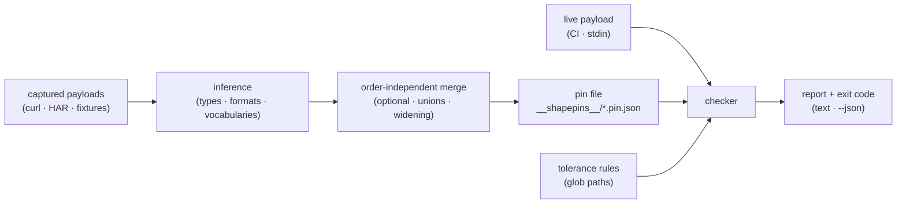

# shapepin

[English](README.md) | [中文](README.zh.md) | [日本語](README.ja.md)

[](LICENSE)   [](CONTRIBUTING.md)

**用捕获的真实样例把 JSON 载荷的结构"钉"住；响应一旦漂移就让 CI 失败。契约从你手头已有的真实载荷推断而来——配以按路径的容差规则——而不是手写规范。**


```bash
# not yet on npm — install from a checkout of this repository
npm install && npm run build && npm pack
npm install -g ./shapepin-0.1.0.tgz
```

## 为什么选 shapepin？

前后端契约漂移是最让人措手不及的一类 bug：后端改了字段名、序列化器开始把价格输出成字符串、ORM 升级让整数变成了浮点数——后端测试全绿，前端却在生产环境里才发现。教科书式的答案是在 CI 里校验 OpenAPI 规范，但那要求规范存在、完整、并且真的保持同步；大多数团队三者一个都没有。而几乎每个团队*确实*拥有的，是捕获下来的载荷——curl 的输出、从 HAR 提取的响应体、早已提交进前端仓库的 fixture。shapepin 让这些捕获成为契约本身：喂给它几份真实响应，它就推断出一个钉住的结构——必填与可选字段、整数与浮点、可空性、UUID 和 RFC 3339 时间戳等字符串格式、甚至在值重复出现时锁定为封闭枚举——写进一个确定性的、可被 git diff 的 pin 文件。之后 `shapepin check` 在响应不再匹配的那一刻就以具体路径让 CI 失败，而按路径的容差规则让你恰好放行你接受的那一种漂移（`/orders/*/note=optional`），却不为其他一切敞开大门。不用编写规范，不用学习模式语言，无网络，零依赖。

| | shapepin | 手写 JSON Schema + ajv | OpenAPI + 校验器 | Pact | 对载荷做 Jest 快照 |
|---|---|---|---|---|---|
| 契约来源 | ✅ 捕获的真实载荷 | ❌ 人工编写 | ❌ 人工编写 | ❌ 人工编写消费者测试 | ✅ 捕获 |
| 契约自身不失真 | ✅ 重钉 = 相同字节 | 🟡 与现实渐行渐远 | 🟡 出了名地失真 | 🟡 依赖纪律 | ❌ 任何变化都击穿它 |
| 按路径放行*选定的*漂移 | ✅ 7 种规则 + glob 路径 | 🟡 重写 schema | 🟡 重写规范 | 🟡 编写 matcher 代码 | ❌ 全有或全无 |
| 检出新增/更名字段 | ✅ 默认行为 | 🟡 需 additionalProperties | 🟡 取决于配置 | ✅ | ✅ 但被值噪声淹没 |
| 值层面噪声（id、时间戳） | ✅ 钉格式而非钉值 | ✅ | ✅ | ✅ | ❌ 每次运行都不同 |
| 需要 broker / 服务器 / 网络 | ✅ 从不 | ✅ 不需要 | ✅ 不需要 | ❌ 实际使用需 broker | ✅ 不需要 |
| 运行时依赖 | ✅ 零 | ❌ ajv 全家桶 | ❌ 校验器栈 | ❌ 相当可观 | ❌ Jest 栈 |

<sub>对比基于各工具 2026-07 的公开文档与行为。shapepin 检查的是结构，不是值或业务语义——它刻意不评判 `total` 是否*算对了*，只关心它是否仍是数字。精确语义见 [docs/pin-format.md](docs/pin-format.md)。</sub>

## 特性

- **契约靠推断，从不靠编写** — 把 `shapepin pin` 指向几份捕获的响应，就得到完整的结构契约：必填与可选字段、整数与浮点、可空联合、数组元素结构。你手头已有的捕获就是规范。
- **有证据才锁枚举与格式** — 字符串字段只有在值跨捕获重复出现时才锁定为 `"delivered" | "pending" | "shipped"`（单个样例永不锁定）；UUID、RFC 3339 时间戳、日期、邮箱和 URL 被钉为*格式*，新的 id 和时间戳绝不制造噪声。
- **按路径的容差规则** — 七种规则（`optional`、`nullable`、`any`、`open-enum`、`open-format`、`number`、`extra-fields`）通过 glob 路径（`/orders/*/note`、`/**/updatedAt`）寻址，恰好放行你接受的漂移，绝不多放一分；模式写错是硬错误，绝不静默变成空操作。
- **字节级确定性的 pin 文件** — 固定键序、字段排序、与顺序无关的合并：同一批捕获以任意顺序输入都产出相同字节，因此 pin 的 git diff *就是*审阅者要读的契约变更。
- **为 CI 门禁而生** — 退出码 0/1/2（干净 / 漂移 / 用法错误），`-` 从 stdin 读入以支持 `curl | shapepin check`，稳定的 `--json` 供机器消费，`check --update` 通过加宽 pin 在同一提交里接受有意的漂移。
- **零运行时依赖，完全离线** — 推断、匹配、检查和 CLI 全部在仓库内实现；唯一要求是 Node.js，唯一 devDependency 是 `typescript`，并且从不打开任何 socket。

## 快速上手

用几份捕获的响应钉住一个端点（虚构的 `GET /orders` 的三页数据，随仓库附带于 [examples/](examples/README.md)）：

```bash
cd examples/orders-api
shapepin pin orders captures/*.json --tolerate "/orders/*/note=optional"
shapepin show orders
```

```text
pinned "orders" from 3 examples → __shapepins__/orders.pin.json
pin "orders" — 3 examples, 1 tolerance
tolerances:
  /orders/*/note  optional
shape:
{
  orders: array of {
    currency: "USD"
    customer: {
      email: string (email)
      id: string (uuid)
    }
    id: string (uuid)
    items: array of {
      price: number
      qty: number (integer)
      sku: string
    }
    note: null | string
    placedAt: string (iso-date-time)
    status: "delivered" | "pending" | "shipped"
    total: number
    trackingNumber?: string
  }
  page: {
    number: number (integer)
    size: number (integer)
    totalPages: number (integer)
  }
}
```

提交这个 pin。几周后后端"清理"了序列化器；CI 用新捕获跑 `check`，以退出码 1 失败（真实运行输出）：

```text
$ shapepin check orders drifted/orders-drift.json
✗ drifted/orders-drift.json — 4 drift issues
  /orders/0/items/0/price     type-changed    pinned number, got string ("12.99")
  /orders/0/items/0/discount  new-field       field "discount" was never in a pinned example
  /orders/0/placedAt          format-changed  pinned iso-date-time string, got "tomorrow"
  /orders/0/status            new-enum-value  "canceled" is not one of "delivered" | "pending" | "shipped"
0 clean, 1 drifted, 4 issues · pin "orders" (3 examples, 1 tolerance)
```

新的 `"canceled"` 状态是有意为之？那就恰好容忍它——其余三个问题继续让构建失败：

```bash
shapepin tolerate orders "/orders/*/status=open-enum"
```

整个变更都是有意的？`shapepin check orders new.json --update` 把该载荷合并进 pin，加宽后的 pin 文件与后端变更落在同一个提交里。

## 命令

| 命令 | 作用 | 关键选项 |
|---|---|---|
| `pin <name> <files…>` | 从捕获的载荷推断出 pin | `--merge`、`--force`、`--split`、`--tolerate <p>=<r>` |
| `check <name> <files…>` | 校验载荷，漂移即失败 | `--update`、`--json` |
| `show <name>` | 打印钉住的签名 | `--json` |
| `ls` | 列出 pin 及其样例数 | `--json` |
| `tolerate <name> <p>=<r>` | 添加或移除容差规则 | `--rm` |

pin 存放于 fixture 旁的 `__shapepins__/`（可用 `--dir` 覆盖）。`-` 从 stdin 读入一份载荷。退出码：`0` 干净，`1` 漂移，`2` 用法或输入错误。

## 什么算漂移

| 载荷中的变化 | check 报告 | 可静默它的容差 |
|---|---|---|
| 必填字段缺失 | `missing-field` | `optional` |
| 从未见过的字段 | `new-field` | `extra-fields`（作用于对象） |
| JSON 类型改变 | `type-changed` | — 设计上没有 |
| 从未观测到 `null` 处出现 `null` | `null-value` | `nullable` |
| 值落在锁定枚举之外 | `new-enum-value` | `open-enum` |
| 钉住的格式被打破（uuid、日期…） | `format-changed` | `open-format` |
| 只见过整数处出现浮点 | `number-widened` | `number` |

每个问题都带着具体的载荷路径（`/orders/0/items/0/price`），一个坏字段绝不会掩盖另一个。完整语义、枚举锁定启发式和模式语言见 [docs/pin-format.md](docs/pin-format.md)。

## 架构



## 路线图

- [x] 结构推断、顺序无关合并、基于证据的枚举/格式、七类漂移检查器、按路径容差、确定性 pin 文件、pin/check/show/ls/tolerate CLI、89 个测试 + 冒烟脚本（v0.1.0）
- [ ] `shapepin pin --from-har`：从 HAR 文件按端点提取样例
- [ ] pin 对 pin 的 diff（`shapepin diff old.pin.json new.pin.json`），用于审阅契约演进
- [ ] 数组与数字的可选长度/范围事实（opt-in，默认关闭）
- [ ] 从 pin 生成 TypeScript 声明（`shapepin show --dts`）
- [ ] 对着运行中的后端做本地开发的 watch 模式
- [ ] 发布到 npm

完整列表见 [open issues](https://github.com/JaydenCJ/shapepin/issues)。

## 贡献

欢迎贡献。先 `npm install && npm run build` 构建，然后运行 `npm test` 和 `bash scripts/smoke.sh`（必须打印 `SMOKE OK`）——本仓库不附带 CI，上面的每一项声明都由本地运行验证。参见 [CONTRIBUTING.md](CONTRIBUTING.md)，认领一个 [good first issue](https://github.com/JaydenCJ/shapepin/issues?q=is%3Aissue+is%3Aopen+label%3A%22good+first+issue%22)，或发起一场 [discussion](https://github.com/JaydenCJ/shapepin/discussions)。

## 许可证

[MIT](LICENSE)
